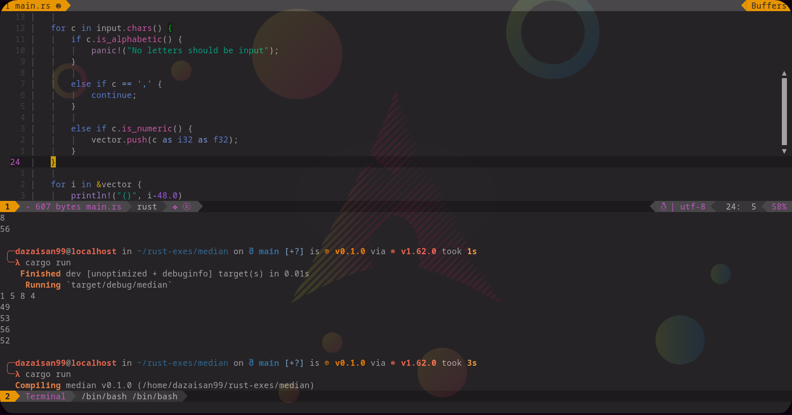

# Ancli-poems

Ancli-poems is a simple command line tool to help create anki cards from poems.

### Example


<details><summary><strong>Installation</strong></summary> 
<p> 

### Dependencies
#### *You will only need cargo and git for the installation process*

### Process

Git clone the repository and go into it

```console
$ git clone https://github.com/dazaisan99/ancli-poetry

$ cd ancli-poetry
```

Build the crate

```console
$ cargo build --release
```

Finally, move the executable in ```target/release``` to a directory in your path (e.g. /usr/bin/ for linux)
</p> 
</details>

## Usage

```console
$ ancli-poetry -p/--path <PATH> -n/--name <NAME> [-h/--help]
```

<PATH> is the path to the file you want to create cards with

<NAME> is the name you want the deck created to have